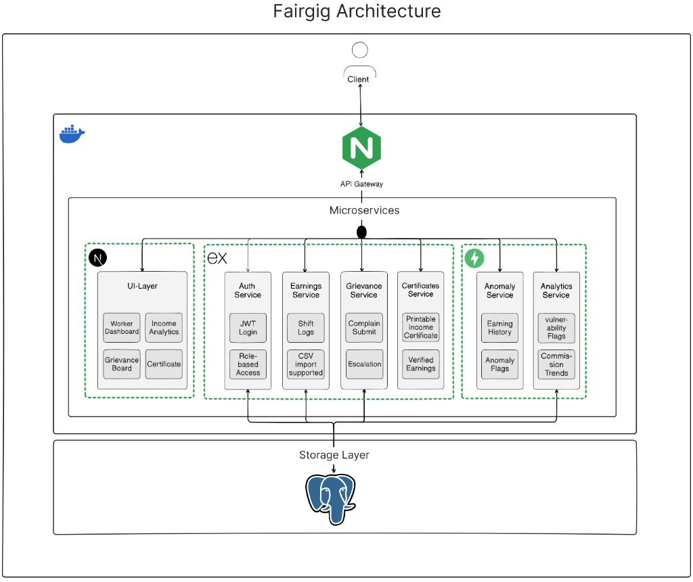

# FairGig

A platform for gig workers to log, verify, and understand their earnings across platforms — and for labour advocates to spot systemic unfairness at scale.

## Architecture



## Services

| Service | Tech | Port | Responsibility |
|---|---|---|---|
| **frontend** | Next.js 16 · React 19 · Tailwind v4 | 3000 | Worker & advocate UI |
| **auth** | Node · Express · Prisma · JWT | 8001 | Identity, roles, tokens |
| **earnings** | Node · Express · Prisma · Multer | 8002 | Shifts, CSV ingestion, verification |
| **anomaly** | Python · FastAPI | 8003 | Statistical anomaly detection |
| **grievance** | Node · Express · Prisma | 8004 | Complaints and cluster tracking |
| **analytics** | Python · FastAPI · psycopg2 | 8005 | Aggregate income & commission stats |
| **certificate** | Node · Express · EJS | 8006 | Printable income certificates |
| **nginx** | nginx:alpine | 80 | Reverse proxy / edge router |

All services run on a shared Docker network (`fairgig`) behind nginx. The three Node services (auth, earnings, grievance) and the certificate renderer share a **Neon** (hosted Postgres) database via Prisma. The two FastAPI services connect directly or via HTTP to peer services.

## Quickstart

```bash
# 1. Copy and fill env vars
cp .env.example .env

# 2. Start everything
docker compose up --build
```
